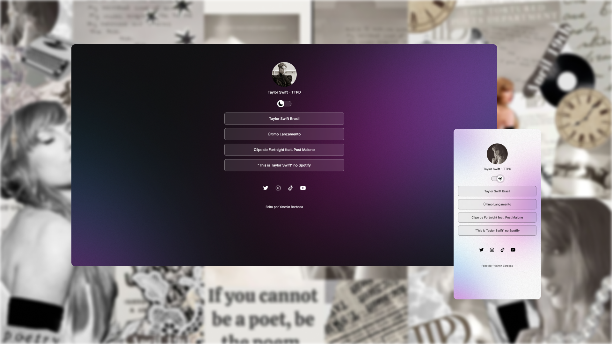
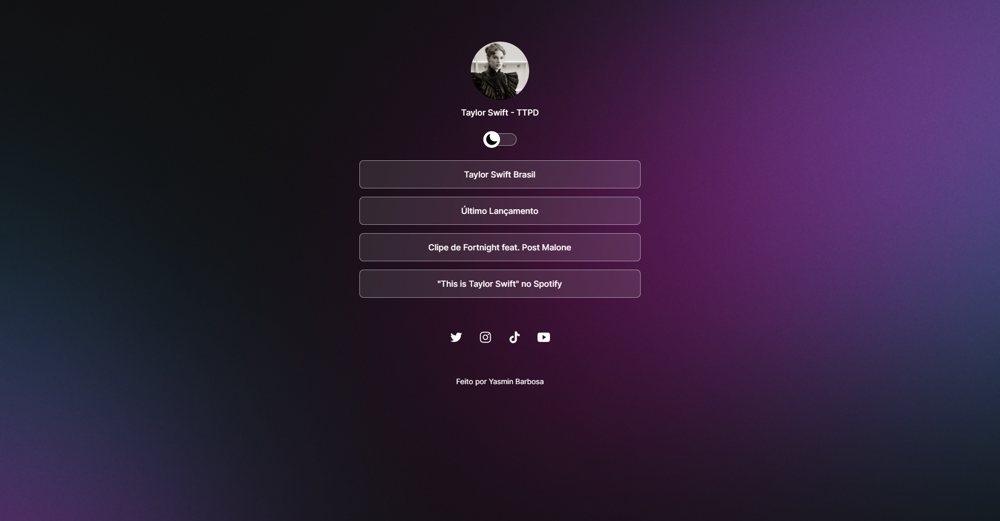
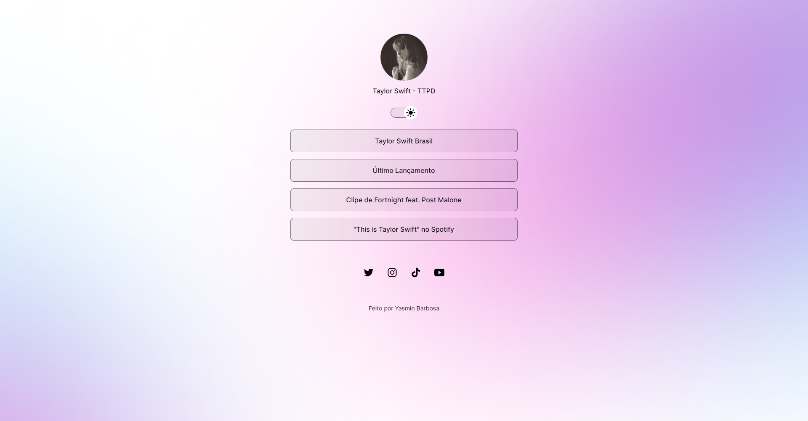
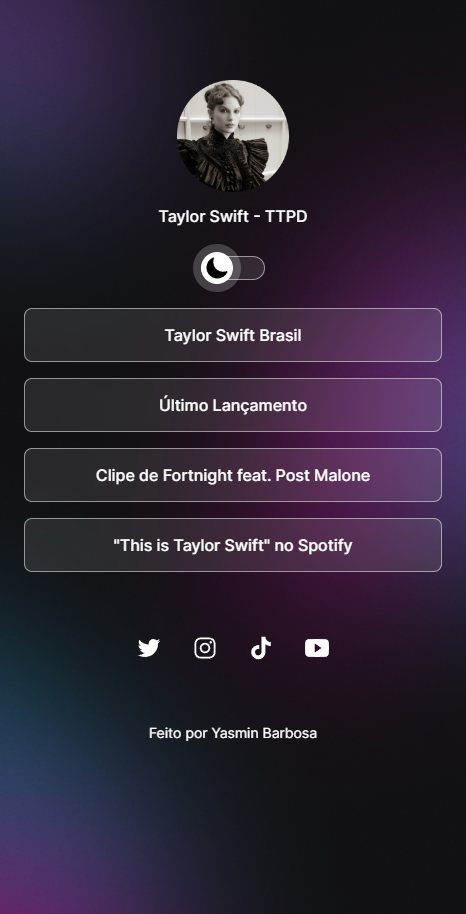
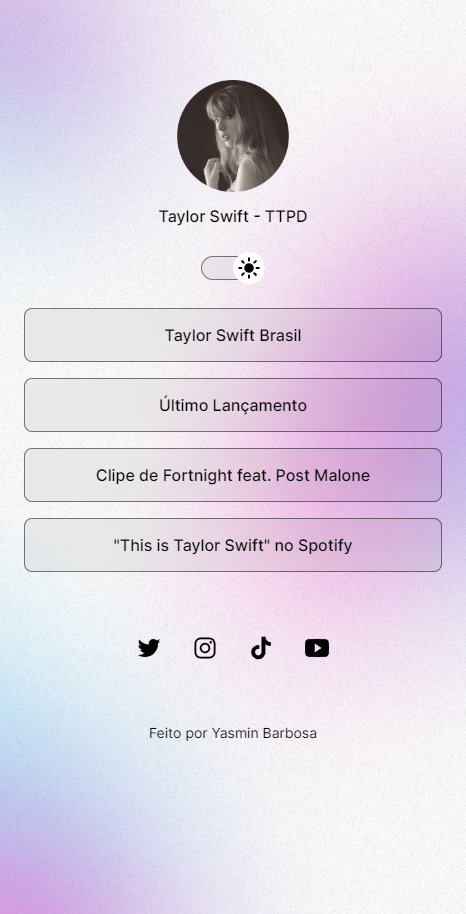

# 💻 Projeto

O projeto é um agregador de links desenvolvido durante o curso de formação básica <a href="https://www.rocketseat.com.br/discover" target="_blank">Discover</a> em HTML, CSS e JavaScript da <a href="https://www.rocketseat.com.br/" target="_blank">Rocketseat</a>.

## Índice

- [Detalhes do projeto](#detalhes-do-projeto)
- [Tecnologias](#tecnologias)
- [Previews](#previews)

 

 <h1 id="detalhes-do-projeto">📋 Detalhes do projeto </h1>

O agrupador de páginas consiste num site que possui 4 redirecionadores, além de ícones de redes sociais que redirecionam para os respectivos perfis. Também, com o auxílio do JavaScript foi possível adicionar um botão que permite a alternar entre tema claro e escuro.

Você pode acessar o projeto <a href="https://jackemimi.github.io/Projeto-Discover/" rel="nofollow">clicando aqui</a>

<h2 id="tecnologias">🚀 Tecnologias</h2>
Esse projeto foi desenvolvido com as seguintes tecnologias:

- HTML
- CSS
- JavaScript
- Git e Github
- Figma

<h2 id="previews">👀 Previews</h2>

### Versão Desktop

<figure>

<figcaption>Captura de tela da home do site na versão desktop dark mode.</figcaption>
</figure>

<figure>

<figcaption>Captura de tela da home do site na versão desktop light mode.</figcaption>
</figure>

 

### Versão Mobile

<figure>

<figcaption>Captura de tela da home do site na versão mobile light mode.</figcaption>
</figure>

<figure>

<figcaption>Captura de tela da home do site na versão moible light mode.</figcaption>
</figure>

#

Obrigado pela visita!

Esse projeto foi feito com ❤ por Yasmin Barbosa.

